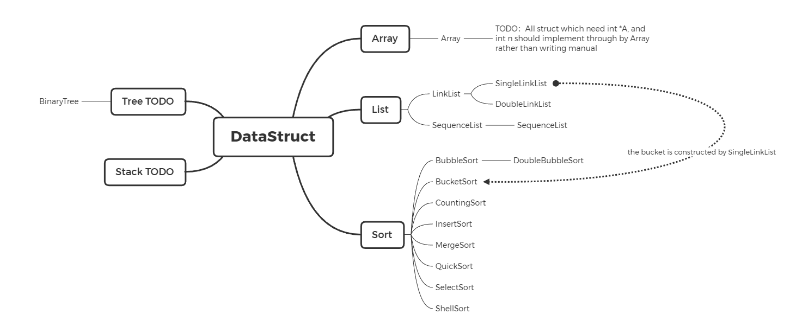

Data Struct repo

something notice and convention:
* `.h` file contains function implementation for convenience
* assume all number which maybe use is `int` type
* use `CLion 2020.2.3` compile
* compile standard is `c99`

Coding style:
* use CLion to format code indent
* use under score case to name variable
* use upper case to name const variable
* use lower camel case to name function
* use lower case and underline to name struct
* use Upper camel case to name variable defined by `typedef`
* function name with `__` denote is private function(for expect) 
* function name with `_` will carry some addition information, like `mergeSort_2` denote it is 2 road merge sort

I make a mind map to help you understand this repo struct

You can check the latest version of the mind map here: [link](https://github.com/hhmy27/myMindMaps/blob/master/%E6%95%B0%E6%8D%AE%E7%BB%93%E6%9E%84/DataStructRepo.xmind)

